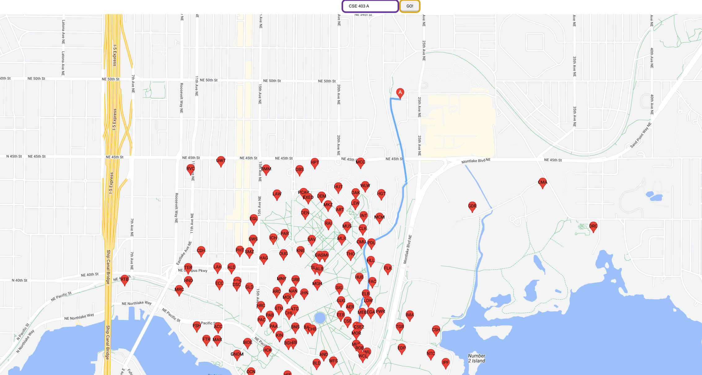
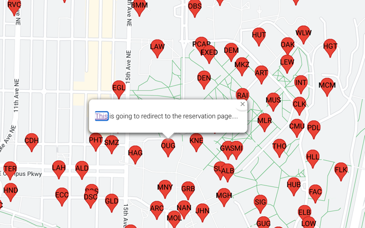
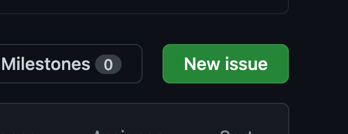
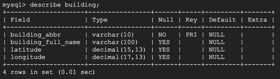
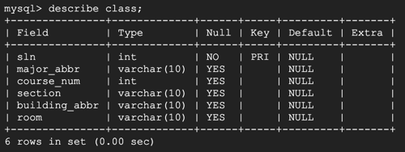
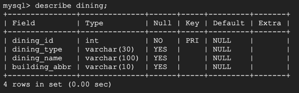
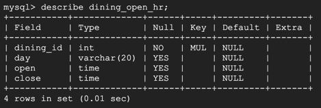
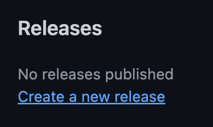
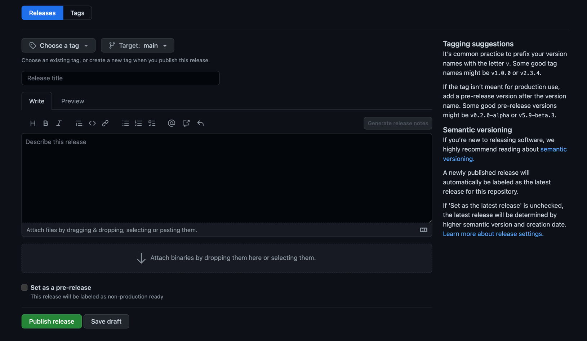

# CSE403 Software Engineering

## Project: DubMap

#### This DubMap project will be an all-in-one campus map platform for UW that would allow users with easy navigation between classes, access to on-campus dining information, and bookings/reservations to the UW buildings and facilities on campus. 

##### Major features

- UW campus-wise Map with clickable buildings, with navigation systems that can lead students to walk between different buildings.
- Navigation route from user's current location to the target building (via user entering course code)
- Adapt a list of buildings that are available for reservation/room-booking, make them clickable for user on the Map and redirect to the reservation page.
- Based on user's current location, query and display a list of dining options information that are currently available sorted by relative distance.

##### Stretch goals

- For the room reservation system, find out whether students are allowed in the specific building. If not, suggest rooms with availability and permission.
- Reservation availability of each room of buildings synchronous to the UW Library system, with the description of each room, such as maximum people allowed and facilities included.
- Linked with MyUW, and automatically generate routine among each classroom per day, without human intervention.
- Try to suggest and lead students to an appropriate study place during the spare time between lectures, according to routine, time, and facility requirements, saving time for finding spots.
- Optimize facilities usage in general by integrating classrooms on the map with the associates class code. For example, the user would be able to search for building with
  class code, and the user would be able to get a list of classes in the building.
- Have a centralized platform through which the users can explore their options of room reservation through campus
---

## User Documentation
### How to Run DubMap

> **Note**
> The database instance hosted on GCP will often-times be turned off to save money for your dev account, if any course staff wants to try out DubMap, please ping Yingfan on Slack.

> **Note**
> We currently only support CSE courses in our database. So don't be surprised when you get no response from non-CSE class.

#### To obtain the source code, run the command `git clone git@github.com:yingfc/cse403.git` to clone the entire project to your local machine.
#### Backend SparkJava Server (Live!!!)
> **Note**
> The Backend Server has been deployed to cloud machine on AWS (http://35.91.246.29:4567/hello), and you will not need to run it anymore :) But feel free to continue read if you are interested.

| method type | endpoint                             | example                                  | description                                                             |
|-------------|--------------------------------------|------------------------------------------|-------------------------------------------------------------------------|
| GET         | /hello                               | /hello                                   | welcome page of backend API server                                      |
| GET         | /buildings                           | /buildings                               | show all the buildings on campus                                        |
| GET         | /building/:abbr                      | /building/CSE2                           | show the specific building information given the building's abbreviation |
| GET         | /class?major=x&coursenum=x&section=x | /class?major=CSE&coursenum=484&section=AC | show the specific building information where the class is held          |
| GET         | /diningplaces                        | /diningplaces                            | show the dining/cafe with opening hour and if it is currently open      |
- load the entire project in IntelliJ
- set up project SDK in **File > Project Structure > Project**, choose **JDK 11** and apply
- go to root directory of the project and create a `.env` file and add the db information there, plz ask **@Yingfan (Eric) Chen** for the username & password
```
  DB_URL="jdbc:mysql://34.145.35.221/dubmap_backend?useSSL=false&allowPublicKeyRetrieval=true&serverTimezone=PST"
  DB_USER=""
  DB_PASSWORD=""
```
- go to **build.gradle** or gradle sidebar on the right of IDEA UI to reload the project (it will take some time to download all the dependencies for the first time)
- go to **back-end/src/SparkJavaDemo**, run it
- when you see logs saying **Server - Started**, go to `localhost:4567/hello`, and try out all the endpoints

#### Frontend `npm` Server
> **Note**
> Before running the frontend server, make sure you've enable location sharing in your browser :)

- to configure the front end, you’ll have to create a `.env` file at the root directory of the front-end.
```
REACT_APP_UW_LIBRARY_RESERVATION_LINK=https://cal.lib.uw.edu/?_gl=1*1qhpnb6*_ga*MTU2MjcyMzAwNC4xNTc4NTI3Mjk2*_ga_63X2ZQHK8P*MTY3NDgzNzQ1NS4zLjAuMTY3NDgzNzQ1NS4wLjAuMA..
REACT_APP_GOOGLE_API=<YOUR GOOGLE API KEY>
REACT_APP_DUBMAP_SERVER=http://35.91.246.29:4567/
```
- to obtain your own Google API key: 
  - Go to the **[Google Maps Platform > Credentials](https://console.cloud.google.com/projectselector2/google/maps-apis/credentials)** page.
  - On the **Credentials** page, click **Create credentials > API key**. The **API key created** dialog displays your newly created API key.
  - Click **Close**. The new API key is listed on the **Credentials** page under **API keys**.
- before running `npm` command to start the frontend server, make sure your machine has installed `Node.js` and `npm`
  - Using Homebrew:
    - Install Node.js and `npm` via running the command in your terminal: `brew install node`
    - Verify Node.js and `npm` installation via running the command in terminal: For node: `node -v`, for npm: `npm -v`
  - Using Windows or Linux: please refer to the detailed instruction [here](https://kinsta.com/blog/how-to-install-node-js/)
- navigate to the root directory of the `front-end/` and run `npm i` and then `npm run start` to launch the project frontend.
- the frontend server will be running on endpoint: `localhost:3000` by default
---

### How to use DubMap
- There are three main functionalities in our Map system
  - **Route navigation**: On the map homepage, user can either enter the course information (e.g. **CSE 403 A**) they are to look for and click the **Go** button, or they can simply select a building marker on the map and then click the **Go there** button. The map system will show the navigation route from user's current location to the target building in both cases. 
  - 
  - **Room reservation**: On the map homepage, user can hover over the mouse to buildings that are open for room reservation, and an info window will pop up right next to the building with clickable words for user to redirect to the corresponding reservation webpage. Then the user can book a room there. 
  - 
  - **Dining options**: work in progress
---

### How to Report a bug
- Go to the above [Issues](https://github.com/yingfc/cse403/issues) page on GitHub UI, and click the new Issue button to report a bug
### Known bugs
- [Issues](https://github.com/yingfc/cse403/issues)
---

## Developer Documentation
### To obtain the source code, run the command `git clone git@github.com:yingfc/cse403.git` to clone the entire project to your local machine.

---
### Tool sets
This frontend of this project will be implemented with React and TypeScript and the backend will use SparkJava with Java. The database is hosted on Google Cloud Platform.

### Repository layout
```
📦 cse403
 ┣ 📂 .github.workflow (CI related setting)
 ┣ 📂 back-end
 ┃ ┗ 📂 test
 ┃ ┃ ┗ 📂 navigation (route navigation related test)
 ┃ ┗ 📂 src
 ┃   ┗ 📂 db (keeps track of the databases of available rooms and reserved rooms and assign students their reserved rooms)
 ┃   ┗ 📂 building (class for building endpoint)
 ┃   ┗ 📂 navigation (classToBuilding demo file)
 ┃   ┗ 📂 response (Spark response)
 ┃   ┗ 📜 MySqlDemo.java (demo file to fetch data from database)
 ┃   ┗ 📜 SparkJavaDemo.java (backend SparkJava server file)
 ┣ 📂 font-end
 ┃ ┗ 📂 src
 ┃   ┗ 📂 components (contains different components of the webpage, subject to further segmentation later on)
 ┃   ┗ 📂 config (map settings)
 ┃   ┗ 📂 tests
 ┣ 📂 reports (weekly reports on progress/reflection)
 ┃ ┗ 📜 Week3Report.md
 ┃ ┗ 📜 Week4Report.md
 ┃ ┗ 📜 Week5Report.md
 ┃ ┗ 📜 Week6Report.md
 ┃ ┗ 📜 Week7Report.md
 ┗ 📜 README.md
```
---
### Database
- We are hosting our MySQL database instance on GCP SQL. 
- public IP: `34.145.35.221`
- password: ask @Yingfan (Eric) Chen 
- instance name: `cse403` 
- database name: `dubmap_backend`
- to access mysql instance locally: `mysql --host=34.145.35.221 --user=XXX --password`
- The database contains the following tables: 
  - `building` - 
  - `class` - 
  - `dining` - 
  - `dining_open_hr` - 

---
### How to Run/Add test
#### Backend
- To conduct our back-end testing, we are using Junit testing infrastructure using a Gradle build.
- Simple run `./gradlew build --info` in the command line will run the backend tests.
- To add new back-end tests, developers need to add new testing file to the folder `back-end/test/`, and our config on gradle will automatically pick up the new tests under this directory.
#### Frontend
- To conduct our front-end testing, we are using puppeteer framework to support CSS, HTML, and JavaScript testing.
- To run front-end tests, first have the backend server running, then run the command `npm run test` will automatically read all the files in that directory and execute the tests.
- To add new front-end tests, developers need to add new testing files to the folder `front-end/src/tests`, then follow the previous step to run the test.
---

### How to build a release of the software
- Trigger the pipeline to build and check that all tests are pass
- Have developers check that the website app is behaving as intended
- Go to [repo](https://github.com/yingfc/cse403) on GitHub UI
- Click **Create a new release** on the right sidebar 
- 
- Then fill out the title and description of the release 
- 
---

### How To Deploy DubMaps
#### Backend
- We are running our backend API server on AWS EC2 instance (ubuntu linux). 
- To run the backend server on the instance, first navigate to the repo top level
- Create an executable jar distribution via running `./gradlew shadowJar`
- Then open a screen session by typing `screen` in the bash prompt
- Then run `java -jar build/libs/cse403-1.0-SNAPSHOT-all.jar` to start the SparkJava server
- Type `CTRL` + `A` followed by `d` to detach your screen session, the script (backend server) will continue to run
- You can disconnect from the SSH session. And once you log back in, you can resume your session by typing in `screen -r`. This is assuming that you have only one detached session.
#### Frontend
- TODO
---

### How To Run And Use DubMaps
- Open Your browser
- Visit the link https://yingfc.github.io/cse403 (this link is a placeholder)
- You can now use DubMaps and its functionalities
---

### Use Cases
Ready for Beta Release (Feb 14th)
- **Route navigation**: User can now enter course information (e.g. CSE 403 A) in the search bar and the map will show the navigation path from user's current location to the target building where the class is held.
- **Room reservation**: User can now hover over to the building/library that are available for reservation, and a info window will show up with clickable link for the user to be redirected to the UW reservation system for room booking.

Work in Progress
- **Dining options**: User should be able to click a "show nearby dining options" button to see a list of currently opening restaurants around campus. And upon clicking the specific restaurant, it will show the navigation path to the dining/cafe on the map.
